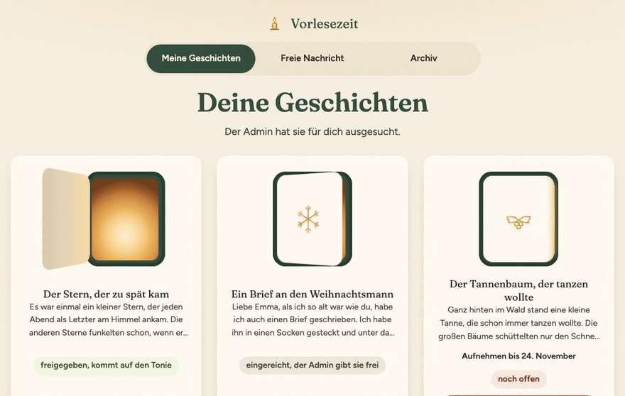
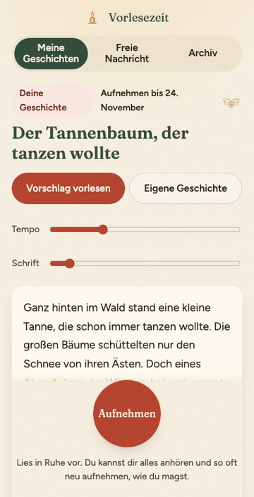
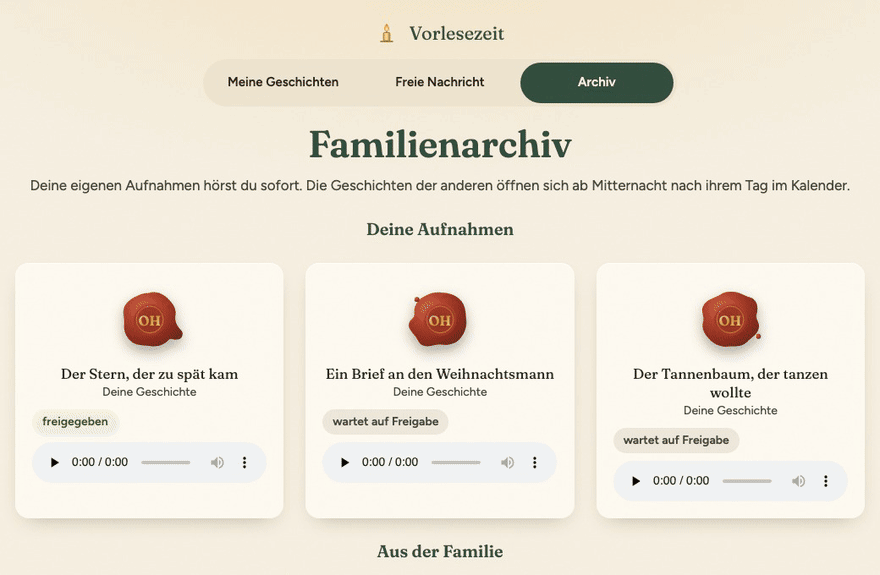
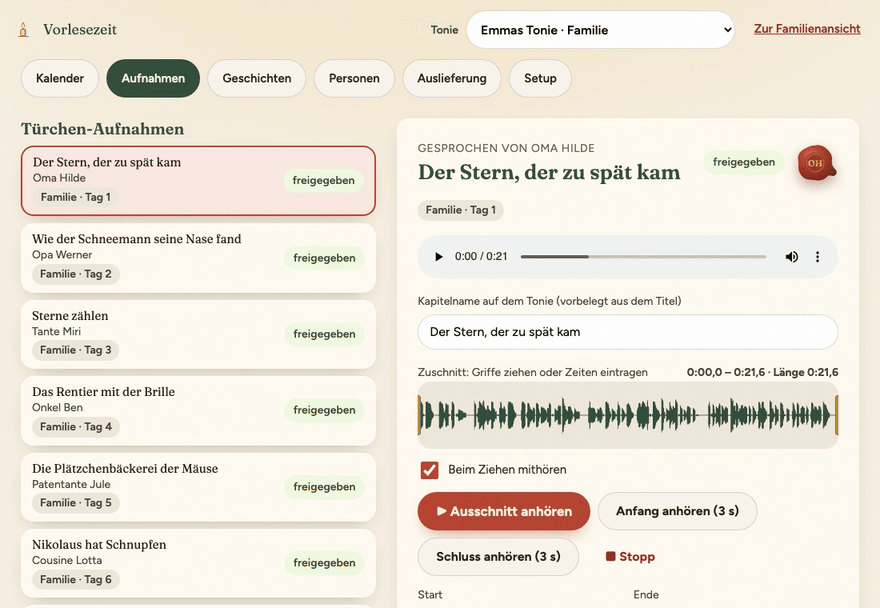
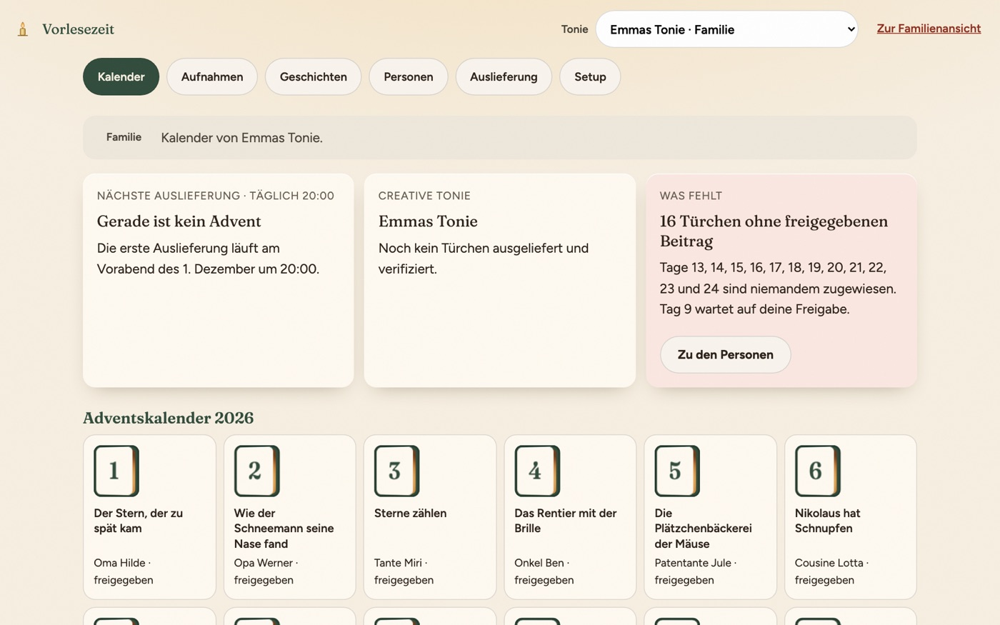
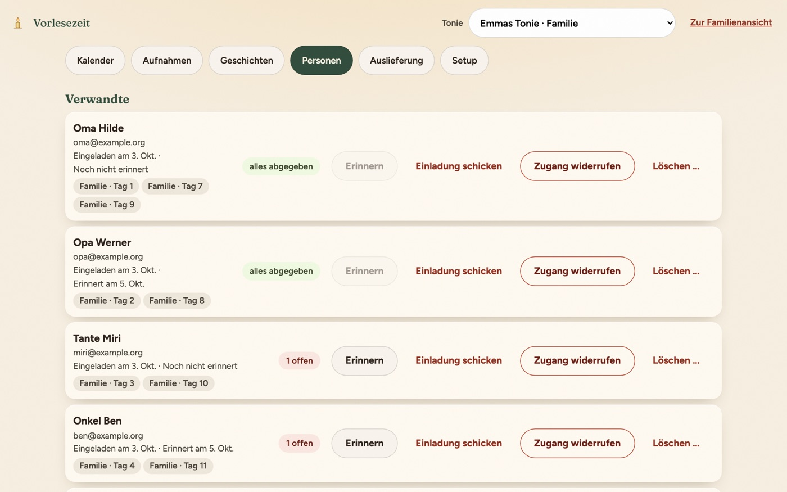
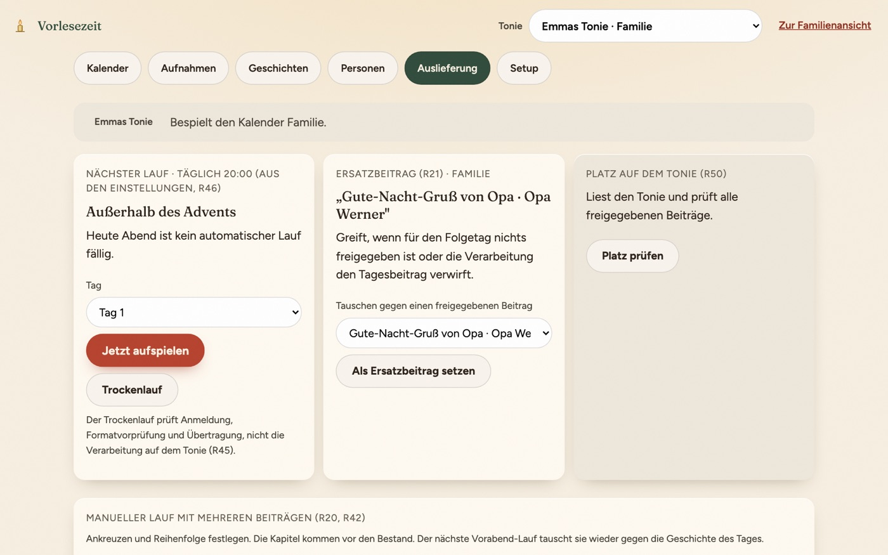
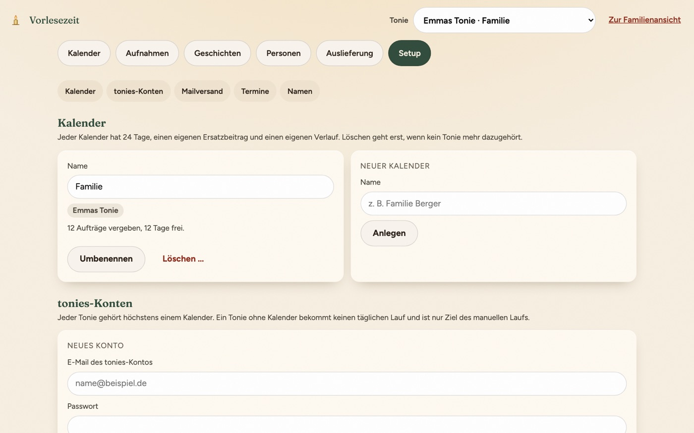
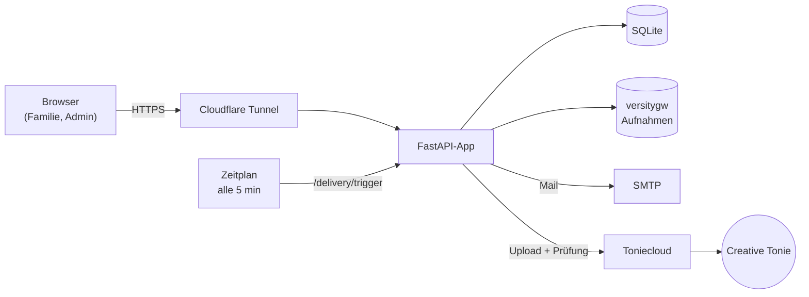

<div align="center">


# Vorlesezeit

**Ein Adventskalender zum Hören: Die Familie liest vor, der Tonie erzählt.**

Verwandte nehmen ihre Weihnachtsgeschichte direkt im Browser auf. Jeden Abend im Advent
spielt Vorlesezeit die Geschichte des nächsten Tages auf einen Creative Tonie. Am Morgen
hört das Kind die Stimme von Oma, Onkel oder Patentante.



</div>

---

## So funktioniert's

1. **Organisator:in verteilt.** 24 Geschichten gehen an Verwandte, die Einladung kommt per Mail. Ein Passwort braucht niemand: Der Link in der Mail genügt.
2. **Die Familie liest vor.** Link am Handy öffnen, Text vorlesen, Aufnahme anhören, abschicken.
3. **Der Tonie erzählt.** Jeden Abend legt Vorlesezeit die Geschichte des nächsten Tages an Platz 1 des Tonies und prüft das Ergebnis nach. Alles, was die Familie selbst auf den Tonie gespielt hat, bleibt dahinter erhalten.

### Aufnehmen am Handy

Wer vorliest, sieht nur das Nötige: den Vorlesetext, einen großen Knopf und die Zeit.

<p align="center">
  
</p>

- **Ein Tipp genügt.** Der Link aus der Mail meldet direkt an. Wer noch eine Geschichte offen hat, landet sofort beim Text.
- **Lichtkranz im Takt der Stimme.** Er zeigt, dass das Mikrofon etwas hört, ganz ohne Pegelanzeige.
- **Text scrollt mit.** Tempo und Schriftgröße lassen sich mit je einem Regler anpassen.
- **Erst anhören, dann abschicken.** Neu aufnehmen geht beliebig oft.
- **Saubere Lautstärke.** Jede Aufnahme wird auf dem Server per ffmpeg zweistufig auf eine einheitliche Lautheit gebracht.
- **Hilfe bei Problemen.** Ist das Mikrofon gesperrt, erklärt die Seite in Ruhe, was zu tun ist. Bei einem In-App-Browser (Instagram, Facebook …) zeigt sie, wie man die Seite im richtigen Browser öffnet.

### Das Familienarchiv

Jede Geschichte öffnet sich für alle ab Mitternacht nach ihrem Adventstag. Bis dahin
bleibt sie hinter ihrem Türchen. Die eigenen Aufnahmen hört man jederzeit.



---

## Für Organisator:innen

Der Admin-Bereich ist bewusst ruhig gehalten: ein Kalender mit 24 Türchen, darunter
Reiter für alles Weitere.



| Kalender | Personen |
|---|---|
|  |  |
| **Auslieferung** | **Setup** |
|  |  |

- **Freigabe vor dem Tonie.** Jede Aufnahme kann vorher angehört, zugeschnitten, mit einem Kapitelnamen versehen, freigegeben oder mit einer freundlichen Mail abgelehnt werden.
- **Ersatzbeitrag.** Fehlt die Geschichte eines Tages oder verwirft der Tonie die Datei, springt ein vorher festgelegter Beitrag ein.
- **Abendmeldung.** Jeden Abend fasst eine Mail zusammen, was auf welchem Tonie gelandet ist. Scheitert ein Lauf, kommt sofort eine eigene Meldung, rechtzeitig, um vor dem Frühstück noch einzugreifen.
- **Bestand bleibt.** Nur die Kapitel, die Vorlesezeit selbst aufgespielt hat, werden ersetzt. Am 25.12. räumt die App ihr Kapitel wieder ab.
- **Mehrere Kalender und Tonies.** Mehrere tonies-Konten und gespiegelte Tonies sind möglich, ebenso Geschichten, die in mehreren Kalendern liegen.
- **Erinnerungen, Einladungen, Widerruf.** Für jede Person gibt es einen sichtbaren Status, und der Zugang lässt sich mit einem Klick entziehen.
- **Trockenlauf und manueller Lauf.** Damit lässt sich die Strecke zum Tonie vorab testen oder ein Tag sofort aufspielen.

---

## Selbst betreiben

Vorlesezeit läuft als kleiner Docker-Compose-Stack: App, Objektspeicher (versitygw), Zeitplan
und Sicherung. Gedacht ist der Betrieb auf einem Heimserver hinter einem Cloudflare Tunnel,
damit am Router kein Port freigegeben werden muss. Für das Mikrofon im Browser ist HTTPS
Pflicht.

- **Betriebshandbuch:** [`docs/betrieb.md`](docs/betrieb.md) – Gerät, Tunnel, Umgebungsvariablen, Sicherung, was bei welcher Mail zu tun ist
- **Vorlage für weitere Instanzen:** [`deploy/freunde/compose.yml`](deploy/freunde/compose.yml) mit festen Image-Versionen
- **Releases:** [`docs/release.md`](docs/release.md) – Images für amd64/arm64 auf ghcr.io, bewusst ohne `latest`

Nach dem ersten Start steht ohne Mailzugang ein einmaliger Einrichtungslink im Log:

```bash
docker compose logs app | grep einrichtung
```

Alle weiteren Einstellungen (tonies-Konto, Mailversand, Lieferzeit, Kindername) pflegt man
im Reiter **Setup**. Zugangsdaten liegen verschlüsselt in der Datenbank.

---

## Entwicklung

**Stack:** Python 3.12, FastAPI + Uvicorn, Jinja2, SQLAlchemy 2 auf SQLite (WAL), boto3
gegen S3-kompatiblen Speicher, ffmpeg, itsdangerous für Magic Links und Sitzungen. Im
Frontend kommt plain JavaScript ohne Build-Schritt zum Einsatz.



Lokal starten (App auf <http://localhost:8000>):

```bash
docker compose up --build
```

Tests und Lint (die Tests brauchen den lokalen S3-Speicher):

```bash
docker compose up -d s3
python -m venv .venv && source .venv/bin/activate
pip install -e ".[dev]"
pytest
ruff check . && ruff format --check app tests scripts
```

---

## Hinweise

- Vorlesezeit nutzt die **inoffizielle Toniecloud-API**, für den privaten Gebrauch mit
  dem eigenen Konto. Sie kann sich jederzeit ändern. Die App behandelt einen Ausfall
  deshalb als realistischen Fall: Es gibt einen Ersatzbeitrag, eine Abendmeldung und einen
  manuellen Weg über die Herstelleroberfläche.
- Vorlesezeit ist kein Produkt der tonies GmbH und steht in keiner Verbindung zu ihr.
  „tonies“, „Tonie“ und „Creative-Tonie“ sind Marken ihrer jeweiligen Inhaber.
- Die Namen, Geschichten und Stimmen in den Bildern sind erfunden. Die Stimmen sind
  synthetisch.

## Lizenz

[MIT](LICENSE)
